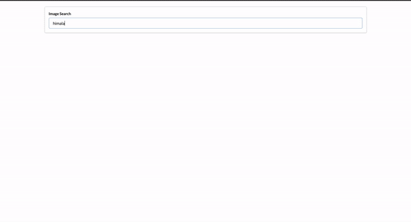

## A simple react application replicating Unsplash, which uses Unsplash API to fetch and present pictures

#### `yarn start`

Runs the app in the development mode. 
Open [http://localhost:3000](http://localhost:3000) to view it in the browser.

The page will reload if you make edits. 
You will also see any lint errors in the console.

